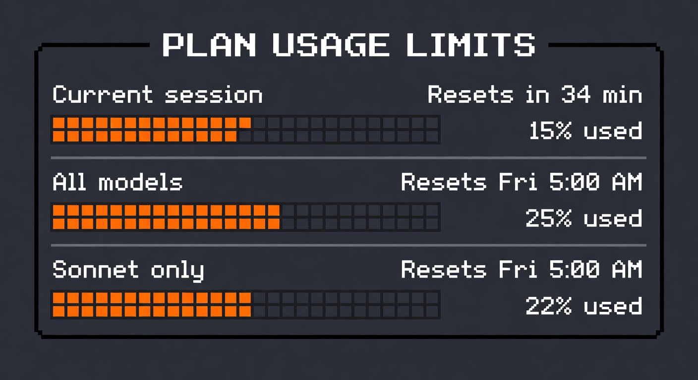

# Claude Code Usage in i3bar



Display your Claude Code usage limits (weekly, session) in your i3 status bar, in orange.

## Vibe code it

Just give Claude Code this prompt:

> Create a python script for ~/bin/i3-claude-usage that fetches my Claude Code usage limits by making a minimal API call to https://api.anthropic.com/v1/messages using the OAuth token in ~/.claude/.credentials.json (under claudeAiOauth.accessToken) and reading the anthropic-ratelimit-unified response headers (5h-utilization, 5h-reset, 7d-utilization, 7d-reset). It needs headers: Authorization Bearer, anthropic-beta: oauth-2025-04-20, anthropic-version: 2023-06-01, and User-Agent: claude-code/2.1.74. Cache results to ~/.claude/.usage-cache.json with 5-minute backoff on failures. Display them compactly as one line. Then create a ~/bin/i3status-wrapper in python that wraps i3status, using output_format i3bar JSON protocol so you can inject the usage as a colored block. Update my i3 config bar section to use the wrapper.

Or follow the manual setup below.

## What it shows

- **W:41%** — Weekly all-models limit usage
- **(16h04m)** — Time until weekly reset
- **5h:61%** — Current 5-hour session limit usage
- **(2h13m)** — Time until 5-hour session reset

Each percentage is followed by its own reset time in parentheses. Refreshes every 5 minutes via the Anthropic API.

## How it works

The script makes a minimal API call (1 token to Haiku) and reads the `anthropic-ratelimit-unified-*` response headers that Anthropic returns on every messages API call. This is more reliable than the dedicated `/api/oauth/usage` endpoint, which is aggressively rate-limited during active Claude Code sessions.

Results are cached to `~/.claude/.usage-cache.json` so that failures serve stale data instead of showing "CC ?".

## Prerequisites

- i3wm with i3bar
- Claude Code CLI installed and authenticated (`claude auth`)
- Python 3
- curl

## Setup

### 1. Create `~/bin/i3-claude-usage`

This script fetches your usage by reading ratelimit headers from the Anthropic messages API.

```python
#!/usr/bin/env python3
"""Fetch Claude Code usage limits for i3bar display.

Gets usage data from ratelimit headers on the messages API,
which is more reliable than the /api/oauth/usage endpoint.
"""

import json
import os
import subprocess
import time
from datetime import datetime, timezone
from pathlib import Path

CREDS_FILE = Path.home() / ".claude" / ".credentials.json"
CACHE_FILE = Path.home() / ".claude" / ".usage-cache.json"
MESSAGES_URL = "https://api.anthropic.com/v1/messages"
BACKOFF_SECS = 300  # Don't retry for 5 min after a failure


def get_token():
    with open(CREDS_FILE) as f:
        creds = json.load(f)
    return creds["claudeAiOauth"]["accessToken"]


def fetch_usage_headers(token):
    """Make a minimal API call and extract ratelimit headers."""
    payload = json.dumps({
        "model": "claude-haiku-4-5-20251001",
        "max_tokens": 1,
        "messages": [{"role": "user", "content": "."}]
    })
    result = subprocess.run(
        [
            "curl", "-s", "-D", "/dev/stderr",
            "-X", "POST",
            "-H", f"Authorization: Bearer {token}",
            "-H", "Content-Type: application/json",
            "-H", "User-Agent: claude-code/2.1.74",
            "-H", "anthropic-beta: oauth-2025-04-20",
            "-H", "anthropic-version: 2023-06-01",
            "-d", payload,
            MESSAGES_URL,
        ],
        capture_output=True, text=True, timeout=15
    )
    # Parse ratelimit headers from stderr (curl -D /dev/stderr)
    headers = {}
    for line in result.stderr.split("\n"):
        if "ratelimit-unified" in line:
            parts = line.strip().split(": ", 1)
            if len(parts) == 2:
                key = parts[0].strip().replace("anthropic-ratelimit-unified-", "")
                headers[key] = parts[1].strip()
    return headers


def read_cache():
    try:
        return json.loads(CACHE_FILE.read_text())
    except Exception:
        return None


def write_cache(output, failed=False):
    data = {"output": output, "ts": datetime.now(timezone.utc).isoformat()}
    if failed:
        data["failed_at"] = time.time()
    CACHE_FILE.write_text(json.dumps(data))


def in_backoff(cache):
    if not cache or "failed_at" not in cache:
        return False
    return (time.time() - cache["failed_at"]) < BACKOFF_SECS


def time_until_ts(epoch):
    """Format seconds-since-epoch as time remaining."""
    diff = int(epoch - time.time())
    if diff <= 0:
        return "now"
    hours = diff // 3600
    mins = (diff % 3600) // 60
    if hours > 0:
        return f"{hours}h{mins:02d}m"
    return f"{mins}m"


def format_from_headers(h):
    """Format ratelimit headers into display string."""
    weekly_pct = int(float(h.get("7d-utilization", 0)) * 100)
    session_pct = int(float(h.get("5h-utilization", 0)) * 100)

    parts = [f"W:{weekly_pct}%"]

    weekly_reset = h.get("7d-reset")
    if weekly_reset:
        parts.append(f"({time_until_ts(float(weekly_reset))})")

    parts.append(f"5h:{session_pct}%")

    session_reset = h.get("5h-reset")
    if session_reset:
        parts.append(f"({time_until_ts(float(session_reset))})")

    return "CC " + " ".join(parts)


def main():
    cache = read_cache()

    if in_backoff(cache):
        print(cache.get("output", "CC ?"))
        return

    try:
        token = get_token()
        headers = fetch_usage_headers(token)

        if not headers or "5h-utilization" not in headers:
            raise RuntimeError("No ratelimit headers in response")

        output = format_from_headers(headers)
        write_cache(output)
        print(output)

    except Exception:
        old_output = cache.get("output") if cache else None
        if old_output and old_output != "CC ?":
            write_cache(old_output, failed=True)
            print(old_output)
        else:
            write_cache("CC ?", failed=True)
            print("CC ?")


if __name__ == "__main__":
    main()
```

Make it executable:

```bash
chmod +x ~/bin/i3-claude-usage
```

Test it:

```bash
~/bin/i3-claude-usage
# Output: CC W:41% (16h04m) 5h:61% (2h13m)
```

### 2. Create `~/bin/i3status-wrapper`

This wraps i3status output, prepending the Claude usage as an orange-colored JSON block using the i3bar protocol.

```python
#!/usr/bin/env python3
"""Wrap i3status output with Claude Code usage in orange using i3bar JSON protocol."""

import json
import os
import subprocess
import sys
import time

REFRESH_INTERVAL = 300


def get_claude_usage():
    try:
        result = subprocess.run(
            [os.path.expanduser("~/bin/i3-claude-usage")],
            capture_output=True, text=True, timeout=15
        )
        return result.stdout.strip() or "CC ?"
    except Exception:
        return "CC ?"


def main():
    proc = subprocess.Popen(["i3status"], stdout=subprocess.PIPE, text=True)

    claude_usage = get_claude_usage()
    last_update = time.time()

    # Read and pass through the version header and opening array bracket
    header = proc.stdout.readline().strip()
    print('{"version":1}')
    sys.stdout.flush()

    # Skip the opening [
    proc.stdout.readline()
    print("[")
    sys.stdout.flush()

    first = True
    for line in proc.stdout:
        line = line.strip()
        if not line:
            continue

        # Strip leading comma for subsequent lines
        if line.startswith(","):
            line = line[1:]

        try:
            blocks = json.loads(line)
        except json.JSONDecodeError:
            continue

        # Refresh claude usage periodically
        now = time.time()
        if now - last_update >= REFRESH_INTERVAL:
            claude_usage = get_claude_usage()
            last_update = now

        # Prepend claude usage block in orange
        claude_block = {
            "full_text": claude_usage,
            "color": "#FF8C00",
            "separator": True,
            "separator_block_width": 15
        }

        all_blocks = [claude_block] + blocks

        prefix = "," if not first else ""
        first = False
        print(prefix + json.dumps(all_blocks), flush=True)


if __name__ == "__main__":
    main()
```

Make it executable:

```bash
chmod +x ~/bin/i3status-wrapper
```

### 3. Configure i3status for JSON output

Create or edit `~/.config/i3status/config` and make sure the `general` block includes:

```
general {
        output_format = "i3bar"
        colors = true
        interval = 5
}
```

### 4. Update i3 config

In `~/.config/i3/config`, change the bar section to use the wrapper:

```
bar {
        status_command ~/bin/i3status-wrapper
}
```

### 5. Reload i3

Press `$mod+Shift+r` or run:

```bash
i3-msg restart
```

## API details

Usage data is read from the `anthropic-ratelimit-unified-*` response headers returned on every Anthropic messages API call. The script makes a minimal 1-token Haiku request to retrieve these headers.

| Header | Description |
|---|---|
| `anthropic-ratelimit-unified-5h-utilization` | Current session usage ratio (0.0–1.0, resets every 5 hours) |
| `anthropic-ratelimit-unified-5h-reset` | Unix timestamp of next 5-hour session reset |
| `anthropic-ratelimit-unified-7d-utilization` | Weekly all-models usage ratio (0.0–1.0) |
| `anthropic-ratelimit-unified-7d-reset` | Unix timestamp of next weekly reset |

The OAuth token stored by Claude Code in `~/.claude/.credentials.json` is used for authentication, with the `anthropic-beta: oauth-2025-04-20` header.

## Customization

- **Color**: Change `#FF8C00` in the wrapper to any hex color
- **Refresh rate**: Change `REFRESH_INTERVAL = 300` (seconds) in the wrapper
- **Backoff**: Change `BACKOFF_SECS = 300` in i3-claude-usage to control retry delay after failures
- **Position**: Move the `claude_block` insertion in `all_blocks` to append instead of prepend
